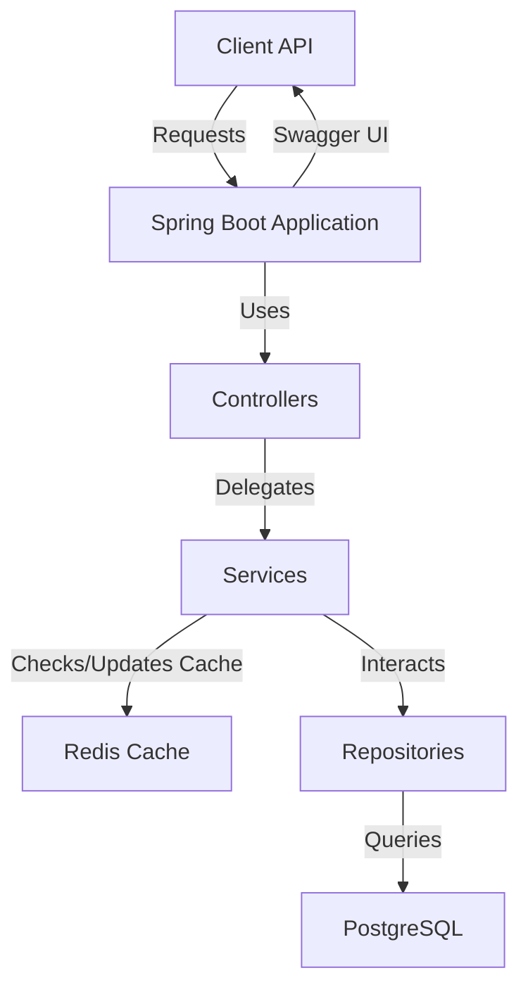
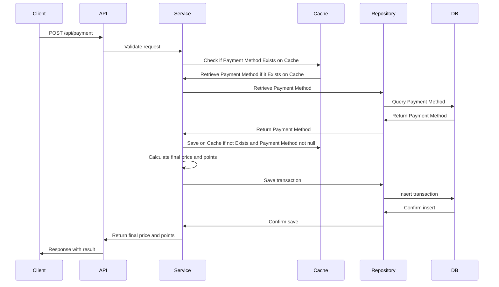
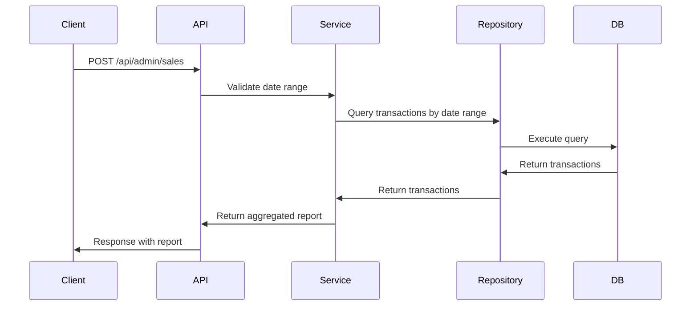

# E-commerce Payment System

## Overview

This project is an e-commerce payment system that manages:
- Payment processing with varying commission rates and points systems based on payment methods.
- Transaction tracking with reports by date ranges.

It uses **Java 21** with **Spring Boot 3.4** and includes configurations for **PostgreSQL** as the database.

---

## Architecture

### Diagram: System Architecture


---

## Sequence Diagrams

### Payment Flow


### Transaction Report


---

## How to Run

### Prerequisites
1. **Docker** and **Docker Compose** installed.
2. **JDK 21** and **Maven** if running locally.

### Steps to Run
1. **Clone the repository**:
    ```bash
    git clone <repository-url>
    cd anymindpayment
    ```

2. **Run with Docker**:

   The API is built directly within the Dockerfile during the image creation process.
    ```bash
    docker-compose up --build
    ```

3. **Access the application**:
   - API Documentation (Swagger UI): [http://localhost:8090/swagger-ui](http://localhost:8080/swagger-ui)

4. **Stop the application**:
    ```bash
    docker-compose down
    ```

---

## Key Endpoints

### Payment Processing
- **POST** `/api/payment`: Process a payment and calculate final price and points.

### Transaction Report
- **POST** `/api/admin/sales`: Fetch sales and points data within a date range.

---

## Testing

To execute unit and integration tests:
```bash
mvn test
```

---

